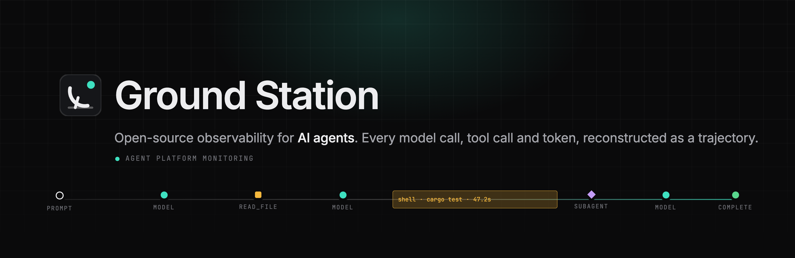
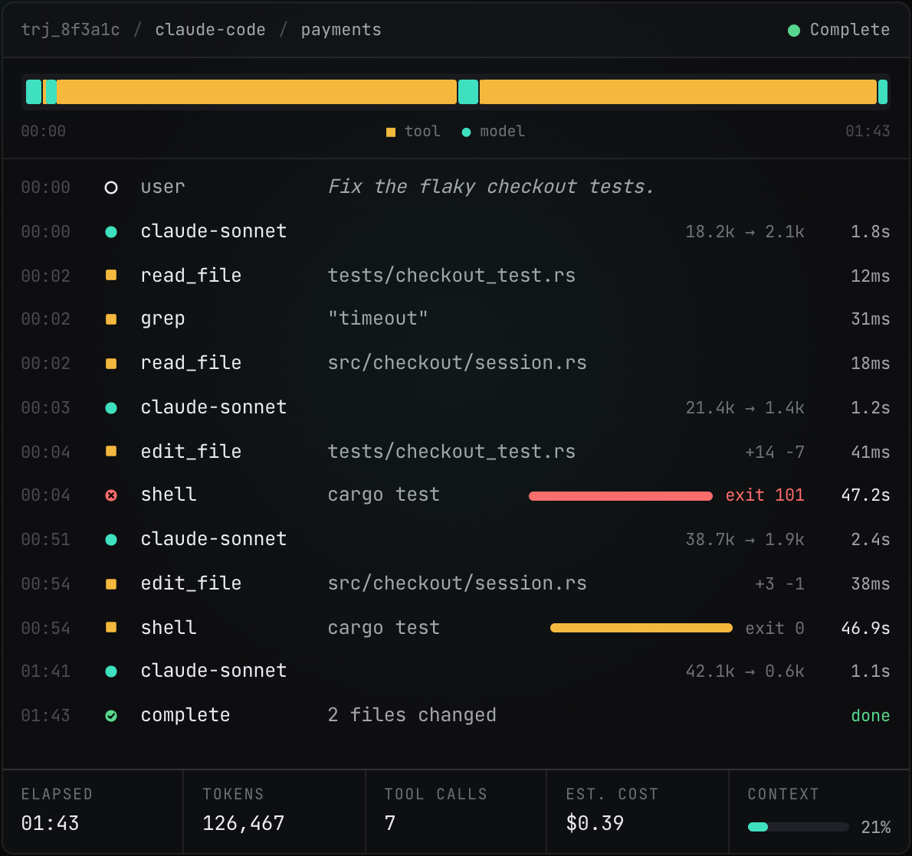

<p align="center">
  <a href="https://groundstation.sh"></a>
</p>

<h1 align="center">
  &nbsp;Ground Station
</h1>

<p align="center">
  <strong>Open-source observability for AI agents.</strong><br>
  Capture every model call, tool call and token. Reconstruct the trajectory. Know why it was slow, what it cost, and what to change.
</p>

<p align="center">
  <a href="https://groundstation.sh"></a>
  
  
  
  
</p>

<br>

## The problem, in one screenshot

A request returns `HTTP 200` in 214 ms. CPU is at 38%. Every dashboard is green. Meanwhile the agent behind that request re-ran the same test suite 18 times, re-read an unchanged file 27 times, filled its context window with stale test output, and spent $2.81 on a task that should have cost forty cents.

Infrastructure monitoring sees the machine. **Ground Station sees the execution.**

<p align="center">
  
</p>

<p align="center"><sub>A real-feeling trajectory: <em>"Fix the flaky checkout tests."</em> Four model calls, seven tool calls, 126,467 tokens, $0.39, and 94 of 103 seconds spent inside <code>cargo test</code>.</sub></p>

<br>

## The trajectory is the primitive

Requests have traces. Agents have **trajectories**: one complete run from prompt to completion, with every turn, model call, tool call, observation and subagent in order, carrying the dimensions that matter.

```text
Trajectory
├── User turn        "Fix the flaky checkout tests."
├── Model call       claude-sonnet   18.2k → 2.1k tokens   1.8s   $0.06
├── Tool call        read_file       tests/checkout_test.rs        12ms
├── Tool call        grep            "timeout"                     31ms
├── Model call       claude-sonnet   21.4k → 1.4k tokens   1.2s
├── Tool call        edit_file       tests/checkout_test.rs  +14 −7
├── Tool call        shell           cargo test           47.2s   exit 101   ◀ the expensive part
├── Model call       claude-sonnet   38.7k → 1.9k tokens   2.4s
├── Tool call        shell           cargo test           46.9s   exit 0
└── Complete         1m 43s · 4 model calls · 7 tool calls · 126,467 tokens · $0.39
```

Ground Station captures all of it: model calls, tool calls, turns, context, tokens, latency, errors, cost, file reads and writes, shell commands, browser actions, subagents. Then it turns that data into something you can actually use.

<br>

## From events to answers

The product climbs a hierarchy, and the hierarchy is also the roadmap.

| | Question | What Ground Station does | |
|:--|:--|:--|:--|
| **Data** | What happened? | Capture every event, losslessly: model, tool, file, shell, browser, subagent, lifecycle. | `v0` |
| **Information** | What is happening? | Reconstruct thousands of events into one trajectory you can read top to bottom. | `v1` |
| **Knowledge** | Why is it happening? | Find the patterns: repeated commands, duplicate reads, context growth, regressions between agent versions. | `v2` |
| **Action** | What should change? | Recommend changes with estimated impact, grounded in the exact trajectory that produced them. | `v3` |

The founding bet is simple: **perfect data → exceptional information.** v0 doesn't need AI analysis. It needs to capture everything, safely. Once enough high-quality trajectories exist, knowledge and action follow.

A taste of where this goes:

```text
OPTIMIZATION OPPORTUNITY                                        rec_7d2e · confidence 0.91

61% of this trajectory was spent executing `cargo test`.
The agent ran the full suite 18 times, once after every edit.

Recommendation
  Run the affected package's tests during iteration.
  Execute the complete suite once before completion.

Estimated impact     runtime −48%     tool calls −17     compute −43%
```

<br>

## How it fits together

```text
Claude Code ─┐
Codex        ├──►  gsd  ──────────►  Ground Station backend  ──►  UI
OpenCode     │   local Rust daemon   ingest · ClickHouse · query
Custom / SDK ┘        │
                      └──────────►  any OTLP backend
```

- **Adapters** attach to an agent runtime through its own hook system, or wrap the process when there is none. No code changes to the agent.
- **`gsd`**, the local daemon, does ingestion, buffering, batching, compression, retry, sampling, redaction, secret filtering, local persistence, schema normalization and auth. It's a single static Rust binary.
- **Redaction happens on your machine**, before anything is uploaded. Secrets are filtered, paths hashed, prompts and tool output excluded by policy. A local-only mode keeps every byte at home.
- **OpenTelemetry-native.** Ground Station doesn't replace OTel, it adds agent semantics. A trajectory is a trace; model and tool invocations are spans; events are span events; measurements are metrics. `gen_ai.*` where a convention exists, `gs.*` for the rest. OTLP in and out.

Policy lives in one file, enforced by the daemon:

```toml
# ~/.config/groundstation/config.toml
[redaction]
secrets  = true                  # stripe, aws, github, openai, jwt, pem …
paths    = "hash"
env      = ["*_KEY", "*_TOKEN", "*_SECRET", "DATABASE_URL"]
exclude  = ["prompt", "tool.output.body"]

[transport]
mode     = "local-only"          # or "cloud"
```

<br>

## Install

```sh
curl -fsSL https://groundstation.sh/install | sh
groundstation connect claude-code       # or: codex, opencode, pi
claude                                  # run your agent as usual; the trajectory shows up
groundstation trajectories              # in the terminal
groundstation ui                        # or in the browser: http://127.0.0.1:4318/
groundstation update                    # later: install the latest release and restart gsd
```

<br>

## Releasing

Releases are cut from the Actions tab, not by hand:

1. **Actions → Prepare release → Run workflow**, pick `patch`, `minor` or `major` (or type an explicit version).
2. The job bumps the workspace version, regenerates [`CHANGELOG.md`](./CHANGELOG.md) from the commit history, commits `Release vX.Y.Z`, tags it, and starts the **Release** workflow.
3. Release builds `groundstation` and `gsd` for all four targets and publishes a GitHub Release with one `.tar.gz` per target, `SHA256SUMS`, a `VERSION` marker (how `install.sh` resolves "latest"), and that version's changelog section as the notes.

The changelog is generated by [git-cliff](https://git-cliff.org) from commit subjects grouped by area, so write subjects as `UI: …`, `CLI: …`, `gsd: …`, `Add …` or `Fix …` ([`cliff.toml`](./cliff.toml) has the rules). Pushing a `vX.Y.Z` tag by hand also works; it must match the workspace version or the build fails on purpose.

<br>

## Repository layout

One repo, one Cargo workspace. The daemon, CLI, backend and UI share a single telemetry schema, so they change together. Language SDKs will get their own repositories once they exist.

```text
groundstation/
├── Cargo.toml                  workspace · edition 2024 · rust 1.88 · resolver 3
├── crates/
│   ├── schema/                 groundstation-schema: event types, identifiers, versioned telemetry schema
│   ├── gsd/                    local daemon (axum ingest, buffering, compression, redaction, embedded UI)
│   ├── groundstation/          the `groundstation` CLI (connect, daemon, status, trajectories, show, ui, resync, config)
│   └── hooks-json/             shared editing of agent hook configs (Claude Code, Codex)
├── adapters/
│   ├── claude-code/            hook install + payload/transcript normalization, with sample fixtures
│   ├── codex/                  same for OpenAI Codex (hooks.json + rollout token usage)
│   ├── opencode/               OpenCode v2+: generated event-forwarding plugin + normalization
│   └── pi/                     pi (pi.dev): generated event-forwarding extension + normalization
├── ui/                         trajectory viewer (Vite + React + TypeScript), see ui/README.md
├── assets/                     logo, banner, screenshots
├── STYLEGUIDE.md               visual language, telemetry conventions, copy voice, code rules
└── README.md
```

Coming next: backend crates over ClickHouse, and more of `docs/`.

```sh
cargo build --workspace
cargo test --workspace
cargo clippy --workspace        # clippy::all warns; unsafe_code is forbidden
```

<br>

## Names, so nobody has to guess

| | |
|:--|:--|
| Product | **Ground Station** |
| Category | Agent Platform Monitoring (APM). Yes, the collision with the old APM is on purpose. |
| CLI | `groundstation` |
| Daemon | `gsd` (not `gs`, which is Ghostscript on most machines) |
| Config | `~/.config/groundstation/config.toml` |
| Schema | `groundstation.telemetry.v0` |
| Listens on | `127.0.0.1:4318`, OTLP-compatible |

<br>

## Contributing

Issues and pull requests are welcome. [`CONTRIBUTING.md`](./CONTRIBUTING.md) has the build, test and commit conventions, and [`SECURITY.md`](./SECURITY.md) explains how to report a vulnerability privately.

## License

Apache-2.0. See [`LICENSE`](./LICENSE) and [`NOTICE`](./NOTICE). Copyright 2026 The Ground Station Authors.

<p align="center"><sub>Every agent leaves a trajectory. Make it observable.</sub></p>
